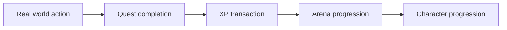

# FORGE architecture overview

## Repository structure

- apps/web: Vite React frontend for the player experience.
- apps/api: Fastify REST API with validations and auth.
- packages/domain: pure TypeScript progression and XP logic.
- packages/db: PostgreSQL schema and migration tooling.
- packages/validation: shared Zod validation rules.

## Core gameplay flow

## Why the XP ledger exists

XP is treated as a derivation of immutable transactions, not a mutable field on the character. This makes the system auditable: the character total can always be explained by the sequence of appended transactions.

## Quest completion transaction

The quest completion endpoint is atomic. In a single transaction, the server verifies quest ownership and state, creates the completion record, marks the quest complete, and inserts exactly one XP transaction. That keeps retries idempotent and prevents double-rewarding a quest.

## Future integration boundary

External systems such as game APIs or OAuth providers are left outside the core domain; adapters can be introduced later without disrupting the progression ledger logic.
